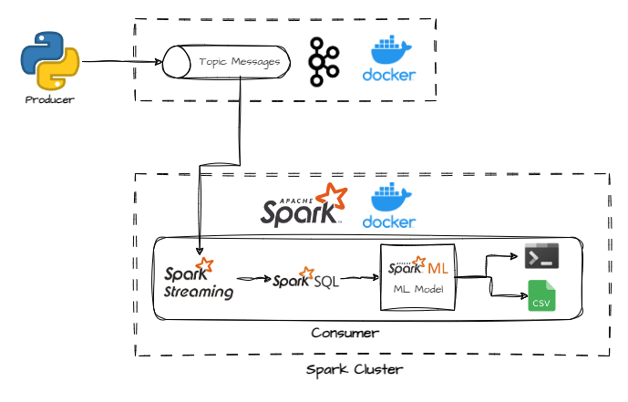
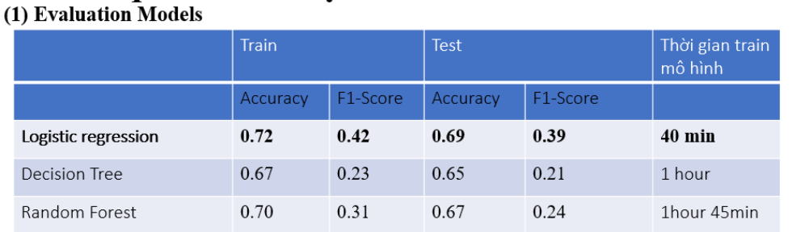

# Building Real-Time CTR Prediction With Kafka and Pyspark.
This project demonstrates a real-time prediction system using Apache Kafka and PySpark. The system is deployed using Docker and leverages Google Colab for training the machine learning model.

# Description Project
The project focuses on building a scalable and efficient real-time prediction system using Kafka as the message broker and PySpark for data processing and model inference. It is designed to handle streaming data and produce predictions in real-time. 

Below a simple illustration of the overall process of this project.


# Features
- Docker Deployment: The entire system is containerized using Docker, ensuring easy deployment and scalability.
- Real-Time Streaming: Utilizes Kafka to ingest and stream data in real-time, allowing for immediate data processing and prediction.
- PySpark for Processing: Leverages PySpark for distributed data processing and model prediction, providing scalability and speed.
- Model Training on Google Colab: The machine learning model is trained using PySpark on Google Colab, taking advantage of its computational resources.

# Folder Structure
- dataset: Containing csv dataset
- setup_kafka: Containing docker compose file to build docker container. Besides, containing producer for the kakfa topic. 
- setup_spark: Containing docker compose file and other files to build docker container. And, containing consumer scripts and machine learning model after trained to predict data in system. 
- training_spark_ml_model: Containing Notebook to build machine learning model applied in real-time system.  
# Dataset
The Avazu Click-Through Rate (CTR) Prediction dataset is designed for building and testing models that predict whether a mobile ad will be clicked. Dataset overview:
- Train: with over 40 million sample
- Test: with over 5 million sample

**More details:** [Avazu Click-Through Rate (CTR) Prediction](https://www.kaggle.com/c/avazu-ctr-prediction/data)  
# Spark ML Model Training 
For this project, we used the Avazu Click-Through Rate (CTR) Prediction dataset to build a model capable of predicting whether an ad will be clicked. This dataset is particularly suited for training machine learning models due to its comprehensive feature set and large volume of records.

### Data Preprocessing

- **Data Source**: The dataset was sourced from the Avazu CTR Prediction competition on Kaggle, consisting of over 40 million samples. We selected a subset of this data for our project.
- **Training Set**: We extracted 800,000 samples from the training dataset.
- **Test Set**: 350,000 samples were used from the test dataset to evaluate model performance.

### Model Building with PySpark MLlib

- **Environment**: Google Colab
- **Framework**: We utilized Apache Spark's MLlib to leverage distributed computing for efficient model training and evaluation.
- **Data Preparation**: First, we separate 'hour' col to 4 new columns. This is "hour_time", "day", "dayofweek", "month". Then, We deal with outlier of some columns by capping.Besides, The categorical features were transformed using techniques such as one-hot encoding to make them suitable for the machine learning algorithms.
- **Model**: 3 Algorithm are used to build model. This is Logistic regression, Decision Tree and Random Forest.
  
### Model Evaluation

- **Performance Metrics**: The model's performance was assessed using standard metrics like accuracy and F1 score.
- **Results**: The trained model was evaluated against the test dataset, providing insights into its predictive capability. Among 3 models, I choose Logistic Regression to put into real-time system, Because it's best models with below evaluation table.


This process demonstrates the effectiveness of using Apache Spark for large-scale data processing and machine learning model training, providing a scalable solution for CTR prediction tasks.

# Real-time Architecture
1) Data Ingestion: Kafka is used to ingest streaming data and act as a message broker between the data source and the processing application.
2) Data Processing: PySpark processes the data in real-time, applying the trained machine learning model to produce predictions.
3) Result: Print result to console and save model prediction to csv. 


# Setup and Configuration
## Prerequisites
- Docker: Ensure Docker is installed on your system.
- Make: Ensure the make package is install on window or linux.
## Set up Kafka cluster on Docker
Open terminal, navigate to the directory *setup_kafka* folder and run bash command to run kafka cluster containers.
```bash
   docker-compose up --build
```
Ensure kafka cluster run successfully. Open an interactive terminal session inside a running kafka brokers container.
```bash
   docker exec -it <kafka-broker-container> /bin/bash
```

Create a topic in kafka cluster.
```bash
/opt/kafka/bin/kafka-topics.sh --create --zookeeper zookeeper:2181 --replication-factor 2 --partitions 1 --topic cte_queue
```
## Set up Spark cluster on Docker
Open terminal, navigate to the directory change directory to *setup_spark* folder and run bash command to run spark cluster containers.
```bash
   make run
```
Ensure kafka cluster run successfully.
## Run Real-time System
To simulate real-time data streaming, we have implemented producer and consumer scripts using Kafka. The producer script is responsible for sending data to a Kafka topic, while the consumer script reads the data from the topic and processes it using Spark.

### Running the Producer Script.
Open terminal, navigate to the directory to *setup_kafka* folder. Execute the producer script with bash command
```bash
   python producer.py
```

### Running the Consumer Script.
Open terminal, navigate to the directory to *setup_spark* folder. Execute the producer script with bash command
```bash
   make submit app=consumer.py
```

### Monitoring and Logging
Kafka Logs and Console: Check the Kafka logs to ensure that messages are being produced and consumed correctly. And on console of producer, message will print

Spark UI and Console: Access the Spark UI to monitor job execution and performance metrics. And on console of consumer, message will print too.

# Credits
## Acknowledgments
- **Ref-1**: [Setting up a Spark standalone cluster on Docker in layman terms](https://medium.com/@MarinAgli1/setting-up-a-spark-standalone-cluster-on-docker-in-layman-terms-8cbdc9fdd14b)
- **Ref-2**: [Getting Started with Apache Kafka on Docker: A Step-by-Step Guide](https://medium.com/@amberkakkar01/getting-started-with-apache-kafka-on-docker-a-step-by-step-guide-48e71e241cf2)

- **Ref-3**: [Structured streaming pyspark kafka](https://subhamkharwal.medium.com/pyspark-structured-streaming-read-from-kafka-64c40767155f)

- **Ref-4**: [Complete Guide to Run Machine Learning on Spark using Spark MLLIB](https://www.analyticsvidhya.com/blog/2022/08/complete-guide-to-run-machine-learning-on-spark-using-spark-mllib/)
## Special Thanks

# Contacts
If you have any questions, suggestions, or would like to collaborate, feel free to contact me:

- **Email**: [vutungprime01@gmail.com](mailto:vutungprime01@gmail.com)
- **LinkedIn**: [huu7ungvu](https://www.linkedin.com/in/huu7ungvuofficial/)
- **Twitter**: [huu7ungvu](https://twitter.com/huu7ungvu)
- **GitHub**: [huu7ungvu](https://github.com/huu7ungvu)

Feel free to open an issue if you find any bugs or have feature requests. I appreciate any feedback or contributions to the project!